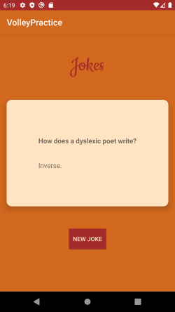
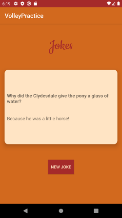

# Volley and HTTP Request
In this app, Volley library is used to create a HTTP GET request.

A request for retrieving a JSONObject is made to get a single random joke from an open api and the Joke is displayed in the main activity.

If user clicks the New Joke button, another request is made for a random joke.

## Screenshots

 &nbsp;&nbsp;&nbsp; 